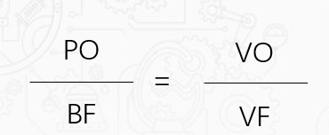
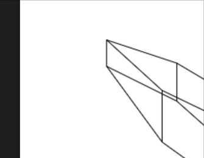

# canvas绘制3d效果

一个物体在空间中，映射在平面上应该是什么样子的呢？那么必然是千变万化的。

## 举个例子
当一个立方体在空间中，从我们的认知中,一般会是以下几个状态。


但实际上远远不止于这几种状态。


截取每一瞬间的图片就会有以下各种形态。


其实一个立方体在平面中有无数个形态。不断的去渐进变化形态，就会给予人3d的氛围感。

## 3d效果原理
想象我们在一个3维的空间中去观察一个旋转的立方体


空间中的立方体是立体的，但而人眼观察到的立方体是在zx平面上。现在我们再将立方体缩小至一个非常非常小的原点，改变一下直角坐标系的方向。将人移动到Z轴上。


- 将人观察的点定义为V:（Vx,Vy,Vz）
- 将观察的点定义为：B:（x,y,z）
- 从人眼V点观察B点映射到的zx平面上的点为P（Px,Py,Pz）

不妨试着将B点沿着y轴画一道垂直线得到交于y轴的f点


这时候我们就会发现三角形VFB与三角形VOP有这相似三角形的关系。


他们的边长存在等比关系，那么我们就可以得到以下的公式。


我们最终的目的是为了得到3d物体映射在平面上的2d点坐标。所以我们需要求得与P（Px,Py,Pz）相关的值。


经过一步步推算得到：


最后我们将坐标值带入到公式中，就可以得到PO的值，即Py坐标值为


同理我们再将B点放置在ZX平面上观察，链接b点垂直到z轴上，也出现了两个相似三角形。


我们只需要将y相关的值改变为x就可以得到映射在XY面的Px坐标


### 结论
那么任意个3维空间的点，映射在xy平面上就可以得到公式：


在xy平面上，z坐标上的值则为0；由此我们可以得到一个任何一个点在三位空间中映射到xy面上的坐标值。


## 绘制以个立方体

现在我们就使用代码，在canvas上绘制一个平面的立方体：

首先给一个空间立方体的坐标点。
```js
pointMap: {
    a: [400, 400, 400],
    b: [600, 400, 400],
    c: [600, 400, 600],
    d: [400, 400, 600],
    e: [400, 600, 400],
    f: [600, 600, 400],
    g: [600, 600, 600],
    h: [400, 600, 600],
},
```

然后我们先在Z轴找一个观察点
```js
// 观察点
visual: {
    x: 0,
    y: 0,
    z: -150
},
```
根据数学上的坐标直角系，我们先取在负Z轴上观察。


已知我们得到任意空间一点映射到XY面上的坐标


所以我们就可以写出一个方法来：
```js
// 获得被观察点映射的x,y坐标
get2d(x, y, z) {
    var x = (x - this.visual.x) * this.visual.z / (this.visual.z - z);
    var y = (y - this.visual.y) * this.visual.z / (this.visual.z - z);
    var z = z;
    return {
        x: x,
        y: y,
        z: z
    }
},
```

另外我们再准备一下canvas绘制直线的方法，以及绘制平面立方体的方法
```js
// 绘制直线的方法
drawline(from, to) {
    this.ctx.beginPath();
    this.ctx.moveTo(from.x, from.y);
    this.ctx.lineTo(to.x, to.y);
    this.ctx.stroke();
},
```

```js
// 链接个点，绘制立方体
draw() {
    this.ctx.clearRect(0, 0, this.canvasWidth, this.canvasHeight);
    // x,y,z3d映射到2d图
    // 正常x,y平面图
    this.drawline(this.get2d(...this.pointMap.a), this.get2d(...this.pointMap.b))
    this.drawline(this.get2d(...this.pointMap.b), this.get2d(...this.pointMap.c))
    this.drawline(this.get2d(...this.pointMap.c), this.get2d(...this.pointMap.d))
    this.drawline(this.get2d(...this.pointMap.d), this.get2d(...this.pointMap.a))
    this.drawline(this.get2d(...this.pointMap.e), this.get2d(...this.pointMap.f))
    this.drawline(this.get2d(...this.pointMap.f), this.get2d(...this.pointMap.g))
    this.drawline(this.get2d(...this.pointMap.g), this.get2d(...this.pointMap.h))
    this.drawline(this.get2d(...this.pointMap.h), this.get2d(...this.pointMap.e))
    this.drawline(this.get2d(...this.pointMap.a), this.get2d(...this.pointMap.e))
    this.drawline(this.get2d(...this.pointMap.b), this.get2d(...this.pointMap.f))
    this.drawline(this.get2d(...this.pointMap.c), this.get2d(...this.pointMap.g))
    this.drawline(this.get2d(...this.pointMap.d), this.get2d(...this.pointMap.h))
}
```
我们就可以得到以下的平面立方体图


## 绘制旋转立方体


要看清一个立方体的全貌，我们一般有两种方式

- 立方体自转观察
- 围绕立方体观察

### 方体自转观察


我们将立方体放置在y轴上旋转。


取立方体其中的某一点，绕着y轴旋转。以俯视向下看就是这样的图


已知D的坐标为（x,y），根据三角形正弦定理,我们可以知道Rsinα就是旋转之前D点的z坐标，Rcosα就是旋转之前D点的x坐标

那么
- D'的x坐标cos(α+β)R=Rcosαcosβ-Rsinαsinβ 
- D'的z坐标sin(α+β)R=Rsinαcosβ+Rcosαsinβ
  
```js
// 数学公式
sin(α+-β)R=Rsinαcosβ+-Rcosαsinβ
cos(α+-β)R=Rcosαcosβ-+Rsinαsinβ
```

我们再将原先D的位置带入进入，即可得到

- D'的x坐标为xcosβ-zsinβ
- D'的z坐标为zcosβ+xsinβ

每次我们只需要在原来的基础上旋转1度，就能得到最新的D'坐标。我们再稍微整理成代码：
```js
   // 自转
changeself() {
    window.requestAnimationFrame(() => {
        for (let key in this.pointMap) {
        let point = this.pointMap[key]
                // 保存x,y,z坐标
                let x = point[0]
                let y = point[1]
                let z = point[2]
                // 每次旋转1度
                // 变换后的x坐标
                point[0] = x * Math.cos(1 / 180 * Math.PI) - z * Math.sin(1 / 180 * Math.PI)
                 // 绕y轴旋转，y左边不会发生变化
                point[1] = y
                // 变换后的z坐标
                 point[2] = z* Math.cos(1 / 180 * Math.PI) + x  * Math.sin(1 / 180 * Math.PI)
        }
        this.draw()
        this.changeself()
    })
},
```
我们就可以看到旋转的立方体：


但是现在看起来还是优点儿奇怪，那是因为，现在的立方体是绕着y轴旋转，所以，左侧我们就看不到立方体了。

我们的想法是希望立方体能自己在我们面前旋转。


立方体就必须以中心自转，所以我们需要确定立方体的中心点
```js
center: {
    x: 450,
    y: 450,
    z: 450
},
```
然后修改以中心点选装的自转方法
```js
// 自转
changeself() {
    window.requestAnimationFrame(() => {
        for (let key in this.pointMap) {
            let point = this.pointMap[key]
            // 保存x,y,z坐标
            let x = point[0]
            let y = point[1]
            let z = point[2]
            // 每次旋转1度
            // 变换后的x坐标
            point[0] = (x - this.center.x) * Math.cos(1 / 180 * Math.PI) - (z - this.center.z) * Math.sin(1 / 180 * Math.PI) + this.center.x
            // 绕y轴旋转，y左边不会发生变化
            point[1] = y
            // 变换后的z坐标
            point[2] = (z - this.center.z) * Math.cos(1 / 180 * Math.PI) + (x - this.center.x) * Math.sin(1 / 180 * Math.PI) + this.center.z
        }
        this.draw()
        this.changeself()
    })
},
```
最后我们就可以看到旋转的立方体了


### 绕立方体自转观察
现在我们可以看看另一种方法，我们绕着立方体中心旋转看立方体，简而言之就是改变视角。


稍微修改一下自转的方法
```js
    //    视角转
    changeVisual() {
    // 每次旋转1度
    window.requestAnimationFrame(() => {
        let x = this.visual.x;
        let y = this.visual.y;
        let z = this.visual.z;
        // 变换后的x坐标
        var newX = x * Math.cos(1 / 180 * Math.PI) - z * Math.sin(1 / 180 * Math.PI);
        // 绕y轴旋转，y左边不会发生变化
        var newY = y;
        // 变换后的z坐标
        var newZ = z * Math.cos(1 / 180 * Math.PI) + x * Math.sin(1 / 180 * Math.PI)
        this.visual = {
               x: newX,
               y: newY,
               z: newZ
        }
        this.draw();
        this.changeVisual();
    })
},
```


红色的圆圈是绕着y轴旋转的视角，在空间中看到的立方体，有一段区域是无法映射到xy面上，在零界点的时候开始出现一道特别长的形状的立方体图案。


即便我们将视角绕着立方的中心点去改变视角也是同样的效果
```js
   // 视角转
changeVisual() {
    // 每次旋转1度
    window.requestAnimationFrame(() => {
    let x = this.visual.x;
    let y = this.visual.y;
    let z = this.visual.z;
    var newX = (x - this.center.x) * Math.cos(1 / 180 * Math.PI) - (z - this.center.z) * Math.sin(1 / 180 * Math.PI) + this.center.x;
    // 绕y轴旋转，y左边不会发生变化
    var newY = y;
    // 变换后的z坐标
    var newZ = (z - this.center.z) * Math.cos(1 / 180 * Math.PI) + (x - this.center.x) * Math.sin(1 / 180 * Math.PI) + this.center.z;

    this.visual = {
        x: newX,
        y: newY,
        z: newZ
    }
    this.draw();
    this.changeVisual();
        })
},
```


红色圈圈就是我们绕着立方体中心的视角变化。有一部分区域立方体是映射到-xy轴面上。


### 结论
所以想要绘制3d的旋转效果，我们一般都是沿着物体中心去自转。

奉上所有代码
```js
<!DOCTYPE html>
<html>

<head>
    <meta charset="utf-8" />
    <meta name="viewport" content="width=device-width, initial-scale=1.0, maximum-scale=1.0, user-scalable=yes">
    <meta http-equiv="X-UA-Compatible" content="IE=edge">
    <title>3dto2d</title>
    <script src="https://cdn.staticfile.org/jquery/1.10.2/jquery.min.js"></script>
    <script src="https://cdn.jsdelivr.net/npm/vue/dist/vue.js"></script>
</head>
<style>
</style>

<body>
    <div id="app1" v-cloak>
        <div @click="draw()">绘制</div>
        <div @click="changeself()">自转</div>
        <div @click="changeVisual()">视角转</div>
        <canvas id="stage" :width="canvasWidth" :height="canvasHeight"></canvas>
    </div>
    </script>
    <script>
    var app = new Vue({
        el: "#app1",
        data: {
            ctx: null,
            canvasWidth: null,
            canvasHeight: null,
            // 观察点
            visual: {
                x: 0,
                y: 0,
                z: -450
            },
            pointMap: {
                a: [400, 400, 400],
                b: [500, 400, 400],
                c: [500, 400, 500],
                d: [400, 400, 500],
                e: [400, 500, 400],
                f: [500, 500, 400],
                g: [500, 500, 500],
                h: [400, 500, 500],
            },
            center: {
                x: 450,
                y: 450,
                z: 450
            },

        },
        methods: {
            // 视角转
            changeVisual() {
                // 每次旋转1度
                window.requestAnimationFrame(() => {
                    let x = this.visual.x;
                    let y = this.visual.y;
                    let z = this.visual.z;
                    var newX = (x - this.center.x) * Math.cos(1 / 180 * Math.PI) - (z - this.center.z) * Math.sin(1 / 180 * Math.PI) + this.center.x;
                    // 绕y轴旋转，y左边不会发生变化
                    var newY = y;
                    // 变换后的z坐标
                    var newZ = (z - this.center.z) * Math.cos(1 / 180 * Math.PI) + (x - this.center.x) * Math.sin(1 / 180 * Math.PI) + this.center.z;

                    this.visual = {
                        x: newX,
                        y: newY,
                        z: newZ
                    }
                    this.draw();
                    this.changeVisual();
                })
            },
            // 自转
            changeself() {
                window.requestAnimationFrame(() => {
                    for (let key in this.pointMap) {
                        let point = this.pointMap[key]
                        // 保存x,y,z坐标
                        let x = point[0]
                        let y = point[1]
                        let z = point[2]
                        // 每次旋转1度
                        // 变换后的x坐标
                        point[0] = (x - this.center.x) * Math.cos(1 / 180 * Math.PI) - (z - this.center.z) * Math.sin(1 / 180 * Math.PI) + this.center.x
                        // 绕y轴旋转，y左边不会发生变化
                        point[1] = y
                        // 变换后的z坐标
                        point[2] = (z - this.center.z) * Math.cos(1 / 180 * Math.PI) + (x - this.center.x) * Math.sin(1 / 180 * Math.PI) + this.center.z
                    }
                    this.draw()
                    this.changeself()
                })
            },
            drawline(from, to) {
                this.ctx.beginPath();
                this.ctx.moveTo(from.x, from.y);
                this.ctx.lineTo(to.x, to.y);
                this.ctx.stroke();
            },
            // 获得被观察点映射的x,y坐标
            get2d(x, y, z) {
                var x = (x - this.visual.x) * this.visual.z / (this.visual.z - z);
                var y = (y - this.visual.y) * this.visual.z / (this.visual.z - z);
                var z = z;
                return {
                    x: x,
                    y: y,
                    z: z
                }
            },
            // 计算坐标：物体转
            draw() {
                this.ctx.clearRect(0, 0, this.canvasWidth, this.canvasHeight);
                // x,y,z3d映射到2d图
                // 正常x,y平面图
                this.drawline(this.get2d(...this.pointMap.a), this.get2d(...this.pointMap.b))
                this.drawline(this.get2d(...this.pointMap.b), this.get2d(...this.pointMap.c))
                this.drawline(this.get2d(...this.pointMap.c), this.get2d(...this.pointMap.d))
                this.drawline(this.get2d(...this.pointMap.d), this.get2d(...this.pointMap.a))
                this.drawline(this.get2d(...this.pointMap.e), this.get2d(...this.pointMap.f))
                this.drawline(this.get2d(...this.pointMap.f), this.get2d(...this.pointMap.g))
                this.drawline(this.get2d(...this.pointMap.g), this.get2d(...this.pointMap.h))
                this.drawline(this.get2d(...this.pointMap.h), this.get2d(...this.pointMap.e))
                this.drawline(this.get2d(...this.pointMap.a), this.get2d(...this.pointMap.e))
                this.drawline(this.get2d(...this.pointMap.b), this.get2d(...this.pointMap.f))
                this.drawline(this.get2d(...this.pointMap.c), this.get2d(...this.pointMap.g))
                this.drawline(this.get2d(...this.pointMap.d), this.get2d(...this.pointMap.h))
            }
        },
        mounted() {
            // 获得视图尺寸
            this.canvasWidth = Math.floor(document.body.clientWidth);
            this.canvasHeight = Math.ceil(document.body.clientHeight);
            window.onresize = () => {
                this.canvasWidth = Math.floor(document.body.clientWidth);
                this.canvasHeight = Math.ceil(document.body.clientHeight);
            }
            // 获得绘图对象
            var c = document.getElementById("stage");
            this.ctx = c.getContext("2d");
        }
    });
    </script>
</body>

</html>
```

## 举一反三
那么2d的图形转成3d的效果是怎么样的？

### 举个很常见的例子
在很多页面中，我们常常会看到这样的图。


将它拆解一下：

个点运动起来：

曲线绕着中心点旋转：

最后多绘制几个条曲线：


### 做个demo
结合这样的思路，我们就可以做出其他的3d效果的动画。

平面中的几个小球绕着空间某点旋转：

平面连接的小球：

空间连接旋转的小球：


结合自转的方法，以及获取空间映射xy点的方法，可以帮助你绘制各种各种个样的效果。
```js
  // 自转
changeself() {
    window.requestAnimationFrame(() => {
    for (let key in this.pointMap) {
        let point = this.pointMap[key]
        // 保存x,y,z坐标
        let x = point[0]
        let y = point[1]
        let z = point[2]
        // 每次旋转1度
        // 变换后的x坐标
        point[0] = (x - this.center.x) * Math.cos(1 / 180 * Math.PI) - (z - this.center.z) * Math.sin(1 / 180 * Math.PI) + this.center.x
        // 绕y轴旋转，y左边不会发生变化
        point[1] = y
        // 变换后的z坐标
        point[2] = (z - this.center.z) * Math.cos(1 / 180 * Math.PI) + (x - this.center.x) * Math.sin(1 / 180 * Math.PI) + this.center.z
            }
    this.draw()
    this.changeself()
        })
    },

// 获得被观察点映射的x,y坐标
get2d(x, y, z) {
    var x = (x - this.visual.x) * this.visual.z / (this.visual.z - z);
    var y = (y - this.visual.y) * this.visual.z / (this.visual.z - z);
    var z = z;
    return {
        x: x,
        y: y,
        z: z
    }
},
```

期待各位展示的demo。